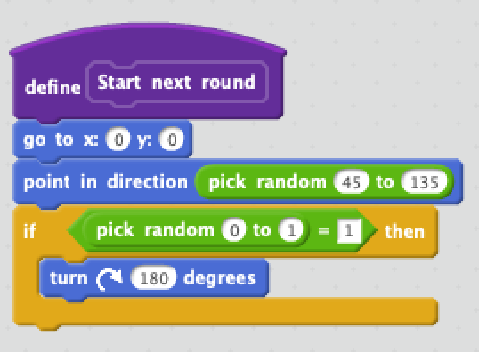
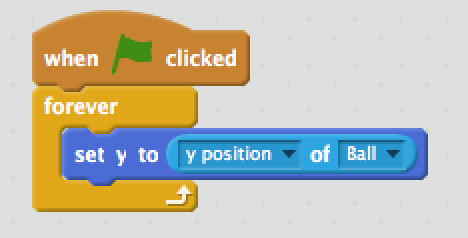

# Pong workshop lesson plan

## Repo layout

the [exampleFiles](exampleFiles) folder contains some example projects in Scratch:

* `pong-ai3.sb2` is a completed Pong game with an AI opponent and scorekeeping.
* `pong-recreated1.sb2` is my WIP re-implementation of the above I am making while writing this lesson plan. I am trying to make it simpler where possible.
* `pong2.sb2` is a completed 2-player Pong game that was the basis for `pong-ai3.sb2`.

# Let's play Pong!

* [History of Pong](https://nerdist.com/atari-pong-45th-anniversary-history-video-game/)
* [Play Pong](https://codeincomplete.com/games/pong/)

## Analyze the game
* What are the objects you can see in the game?
	* Paddles, Ball, Score Display
* What are the rules of the game?
	* Ball goes past a player = other player scores
* What happens when the ball hits a wall? A paddle?
* Where does the ball go when a match starts?

# Making the player's paddle

## Creating the sprite

* Delete the cat (right click, `delete` or use scissor tool)
* Add a sprite from the library
	* Suggestion: `Things` -> `Paddle`
		* Any sprite works
* Give it the name `Player`
* Set rotation style to 
* Rotate until it is facing up (How many degrees is that?) 

## Making it move
* `Scripts` -> `Motion`
* How do we get the paddle to move up?
	* Drag blocks to scripts panel and click them to see what they do

## Making it respond to keys
* `Scripts` -> `Events`
* We need to check frequently if the player is pressing a key.
* How do we start checking when the game starts (when  is pressed?)
	* `Events` -> `when (flag) clicked` 
* Try to talk it through in English.
	* When should it move? How often do we want do make it move?
	* `Control` -> `forever`
		* See the arrow at the bottom? This means it's a **loop**. It's called that because the code inside will be repeated in a loop - in this case, forever.
	* `Control` -> `if-then`

# Making the other paddle
* Right click on player -> `duplicate`
* Drag to other side
* Now, what happens when we press the keys to move the player's paddle?
	* Why?
* Let's change the keys so we can have two players.
	* `Player2` -> change keys to `a` and `z`
	* Now what happens when we press arrows? `a` and `z`?

# Making the ball

## Creating the sprite

* Suggestion: `Things` -> `Ball`

## Making it move
* `Scripts` -> `Motion`
	* `move x steps`
* How do we make it keep moving after the game starts?
	* Try to talk it through in English.
	* `Control` -> `forever`
* Now the ball is stuck! How do we reset it when the game starts?
	* In English, what should it do?
	* Set backdrop to `other` -> `xy-grid`
	* coordiantes are displayed in upper-right of script window
		* drag the ball around and watch the coordinates change
	* `Motion` -> `go to (x, y)`

* What do you think will happen when the ball hits the paddle?
	* Did it bounce? Why not?

## Making it bounce
* How should the ball move when it touches a paddle differently then how it moves normally?
* Let's make the ball always move in the same direction to make it easier for us to test what's happening.
	*  `Motion` -> `point in direction`. 90 degrees
* `Control` -> `if/else`
* `Sensing` -> `touching <sprite>`
* We need to make the ball turn around and move away:

* Now what happens when the ball touches the `Player`? Why?
	* We need to check if it's touching the `Player` also.
	* `Operators` -> `or`
* Play for a bit!

# Tuning paddle speed
* I think the paddles are moving too slowly. How can we make them go faster?
	* Try it
* It would be easier if we could adjust the speed of both paddles at the same time.
	* We can specify a placeholder value that we can change while the game is running. This is called a **variable** because unlike a set number that we type in, its value can vary (change) over time.
* `Data` -> `Make a variable` -> `For all sprites`
	* Call it `Paddle speed`
* Drag the variable over the number we told `Player` to move
* How can we make it negative for moving it down?
	* `operators`-> `*` -> `-1`
* Right click on variable in stage and click `slider`. Now we can drag it around as we play to try different values.

# An edge case
* What happens when the ball hits the top or bottom edge?
* What should happen instead?
	* See any blocks that might help us fix this?
	* `Motion` -> `if on edge, bounce`

# Detecting when someone scores
* What is the rule that tells us when a player has scored?

## Detecting when the ball passes a player
* `Motion` -> `x position`
* `Sensing` -> `<x position> of <sprite>`
* `Operators` -> `<` and `>`
* `Looks` -> `say <thing> for <n> secs`
	* Say "Player 1 scored" or "Player 2 scored"

* What happens after the score message appears? Why?
	* What should happen instead?
		* Next round

# Starting a new round
Scratch lets us make our own blocks out of other blocks!

* `More blocks` -> `Make a block`
* Call it "Start next round"
* Move the blocks that have to do with starting the game into it (`go to x,y`, `point in direction`)

## Making the start more fair
* How does pong decide how to serve the ball?
* `Operators` -> `pick random`
	* try some different values. I like 45 to 135

# Making an AI opponent!
* AI = Artificial Intelligence
* It's often easier to make perfect AI than one that feels more human (i.e. makes mistakes)
	* Sometimes in video games, AI is even allowed to cheat! (Just don't tell the players. 🤫)
* How would you design a perfect opponent?
	* Try to say in English what it should do to intercept the ball.
	* `set y position to <y position of ball>`
	
* Is it cheating? How?

## Making the AI play by the rules
Make it so it can only move how the player can.

* How do you know how to intercept the ball when you are playing?
* How do you control the paddle?
* We can use some of the same techniques we used to detect if the ball went out of bounds.

## Making difficulty settings
* Can you think of some ways we can make it so the AI's skill is adjustable?
	* Make it slower than the player
	* Make it under- or over-estimate the position of the ball
	* Make it check the position of the ball less frequently
* Make a new variable "AI skill"
	* `Data` -> `make a variable` -> `for this sprite only`
	* Make it a slider
* Adjusting speed
	* Replace `Paddle speed` with `<Paddle speed> / <AI skill>`
* Introduce error

* Update position less frequently
	* Use a timer to update a variable every so often & check against that instead of current position
	
# Bonus challenges
Download your project and email it to yourself to take it home!

* Try customizing the backdrop, ball, and paddle with different graphics
* Add sound for when the ball bounces and someone scores
* Add a scoreboard
* Add win/lose conditions based on the player's cumulative score
* Try making another kind of game!
	* Have a look at the Scratch tips menu and [wiki](https://en.scratch-wiki.info/wiki/) for more ideas